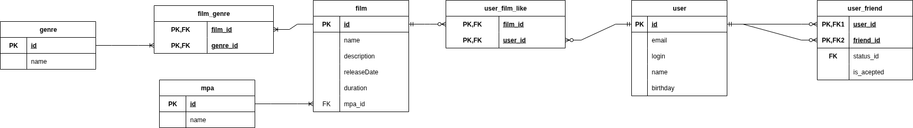

# Промежуточное задание месяца SQL

## Схема



## Описание сущностей

### User

Информация о пользователях

### Film

Информация о фильмах

### Genre

Информация о жанрах

Значения могут быть:

- Комедия.
- Драма.
- Мультфильм.
- Триллер.
- Документальный.
- Боевик.

### mpa

Информация о рейтинге Ассоциации кинокомпаний (англ. Motion Picture Association, сокращённо МРА).

Эта оценка определяет возрастное ограничение для фильма. Значения могут быть следующими:

- G — у фильма нет возрастных ограничений,
- PG — детям рекомендуется смотреть фильм с родителями,
- PG-13 — детям до 13 лет просмотр не желателен,
- R — лицам до 17 лет просматривать фильм можно только в присутствии взрослого,
- NC-17 — лицам до 18 лет просмотр запрещён.

## Ассоциативные таблицы

### film_genre

Связывает фильм и жанр (у нас может быть несколько жанров)

### user_film_like

Связывает фильмы и лайки пользователей.

Учитываем ситуацию что у пользователь может еще не поставить лайк

### user_friend

Отображает друзей пользователя

А также хранит статус заявки

## Прототипы запросов

### Получить список всех пользователей

```
SELECT *
FROM user
```

### Получить список всех фильмов

```
SELECT *
FROM film
```**Передаем TOP_N**


### Получить список всех друзей пользователя

**Передаем USER_ID**

```

SELECT *
FROM user
WHERE id IN (
SELECT friend_id
FROM user_friend
WHERE user_id = ${USER_ID}
)

```

### Получить список всех пользователей поставивших лайк фильму

**Передаем FILM_ID**

```

SELECT *
FROM user
WHERE id IN (
SELECT user_id
FROM user_film_like
WHERE film_id = ${FILM_ID}
)

```

### Получить список популярных фильмов ТОП-N

**Передаем TOP_N**

```

SELECT *
FROM film
WHERE id IN (
SELECT film_id
FROM(
SELECT film_id, count(user_id) as likes_cnt
FROM film_user_like
GROUP BY film_id
ORDER BY likes_cnt DESC
LIMIT ${TOP_N}
)
)

```

### Получить список общих друзей

**Передаем USER_1, USER_2**

```

SELECT *
FROM user
WHERE user_id IN (
SELECT friend_id
FROM user_friend
WHERE user_id = ${USER_1} AND is_accepted = true
AND friend_id IN (
SELECT friend_id
FROM user_friend
WHERE user_id = ${USER_2} AND is_accepted = true
)
)

```
